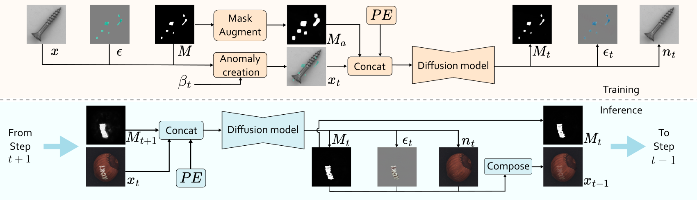
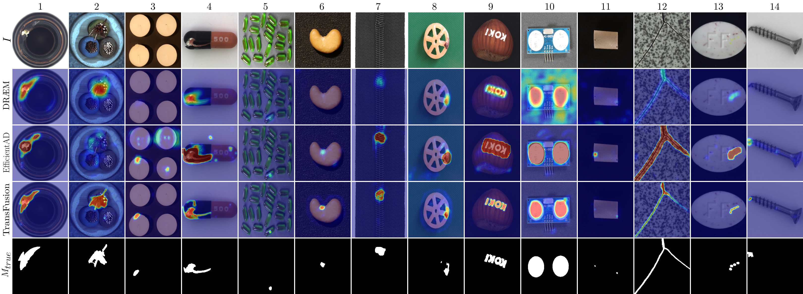

# [ECCV 2024] TransFusion

[](https://paperswithcode.com/sota/rgb-3d-anomaly-detection-and-segmentation-on?p=transfusion-a-transparency-based-diffusion)

[](https://paperswithcode.com/sota/depth-anomaly-detection-and-segmentation-on?p=transfusion-a-transparency-based-diffusion)

[](https://paperswithcode.com/sota/anomaly-detection-on-visa?p=transfusion-a-transparency-based-diffusion)

This repository holds the official Pytorch implementation for the paper [TransFusion -- A Transparency-Based Diffusion Model for Anomaly Detection](https://arxiv.org/abs/2311.09999) accepted at ECCV 2024. Journal paper about the extension to 3D and improvements to the base model coming soon.



## Abstract

Surface anomaly detection is a vital component in manufacturing inspection. Current discriminative methods follow a two-stage architecture composed of a reconstructive network followed by a discriminative network that relies on the reconstruction output. Currently used reconstructive networks often produce poor reconstructions that either still contain anomalies or lack details in anomaly-free regions. Discriminative methods are robust to some reconstructive network failures, suggesting that the discriminative network learns a strong normal appearance signal that the reconstructive networks miss. We reformulate the two-stage architecture into a single-stage iterative process that allows the exchange of information between the reconstruction and localization. We propose a novel transparency-based diffusion process where the transparency of anomalous regions is progressively increased, restoring their normal appearance accurately while maintaining the appearance of anomaly-free regions using localization cues of previous steps. We implement the proposed process as TRANSparency DifFUSION (TransFusion), a novel discriminative anomaly detection method that achieves state-of-the-art performance on both the VisA and the MVTec AD datasets, with an image-level AUROC of 98.5% and 99.2%, respectively.



# TransFusion Environment Setup Guide

To install and set up the TransFusion environment, follow these steps:

 ```bash
    conda create --name TransFusion --file requirements.txt
    conda activate TransFusion
```

# Datasets

1. **Download Anomaly Detection Datasets from the following links: [MVtec3D](https://www.mvtec.com/company/research/datasets/mvtec-3d-ad/downloads), [VisA](https://github.com/amazon-science/spot-diff?tab=readme-ov-file#data-download) and [MVtec AD](https://www.mvtec.com/company/research/datasets/mvtec-ad/downloads)**

2. **(For training only) Downloade the DTD Dataset from the following link: [DTD](https://www.robots.ox.ac.uk/~vgg/data/dtd/)**

3. **(For training only) Download foreground masks using `download_fg_masks.sh` inside the scripts folder**

# Foreground mask extraction

For datasets without provided foreground masks use the following command (exchange the parameters for the correct one) to extract them:

 ```
    python utils/FGMaskCreator.py -p ./datasets/dataset/ -o ./fg_masks/dataset_masks/ -c category_1 -c category_2 ... -c category_n --file-ending png
```

The extraction requires the installation of SAM (see [here](https://github.com/facebookresearch/segment-anything)) and downloading the pretrained weight (`sam_vit_h_4b8939.pth`) inside the `./pretrained_weights/` folder.


# Training

For training on the MVTec3D dataset use the following command (and exchange the paths for the correct ones):

 ```
    python Experiment.py -c train -r RUN_NAME -d ./datasets/mvtec3d/ -ds mvtec3d --mode rgbd --dtd-data-path ./datasets/dtd/images/ 
```

For training on VisA or MVTec AD dataset use the following command (exchange the paths for the correct ones and DATASET for either visa or mvtec):

 ```
    python Experiment.py -c train -r RUN_NAME -d ./datasets/DATASET/ -ds DATASET --mode rgb --dtd-data-path ./datasets/dtd/images/
```

For multiclass training the command stays pretty similar:

 ```
    python Experiment.py -c train_multiclass -r RUN_NAME -d ./datasets/DATASET/ -ds DATASET --mode rgb --dtd-data-path ./datasets/dtd/images/
```

For changes to other parameters check the `Argparser.py` inside `utils`.

# Testing

To evaluate the model on MVTec 3D use the following command:

 ```
    python Experiment.py -c test -r RUN_NAME -d ./datasets/mvtec3d/ -ds mvtec3d --mode rgbd
```

For VisA or MVTec use use the following command (exchange DATASET for either visa or mvtec):

 ```
    python Experiment.py -c test -r RUN_NAME -d ./datasets/DATASET/ -ds DATASET --mode rgb
```

For testing multiclass models use the following command (exchange DATASET for either visa or mvtec):

 ```
    python Experiment.py -c test_multiclass -r RUN_NAME -d ./datasets/DATASET/ -ds DATASET --mode rgb
```

If you want result visualization add the `--visualize` at the end.

## Available Model Weights

Here is a list of currently avaible model weights (all attained at last epoch) and their download links. Preferably download the models using the scripts inside the `scripts` which also setup the correct folder structure for testing. The run names for the weights downloaded with the scripts are `transfusion_mvtec3d`, `transfusion_visa` and `transfusion_mvtec`.

**New**: Added weights for a model trained in a multiclass setting on MVTec AD. Weights for (single class) MVTec AD 2 coming soon.

| Dataset  | Model Weights                                                                                     | Image-level AUROC | AUPRO |
|----------|---------------------------------------------------------------------------------------------------|-------------------|-------|
| MVTec 3D | [Download](https://drive.google.com/file/d/1RZBZqo-lbywk2lPxnr_H--ERFxbCeXqP/view?usp=drive_link) | 98.2              | 98.3  |
| VisA     | [Download](https://drive.google.com/file/d/1iXY6ILcDo33wywyI_zl7Hh8ch2W_5lMz/view?usp=drive_link) | 98.7              | 94.7  |
| MVTec AD | [Download](https://drive.google.com/file/d/1KL7_AwO2zKOHfBY5wcMy_Qj49guSQBc4/view?usp=drive_link) | 99.4              | 95.3  |
| MVTec AD (Multiclass) | [Download](https://drive.google.com/file/d/1l2tbt2IqiHeOmkjIyzA3Jbp2vzrwMLD_/view?usp=sharing) | 92.4              | 81.3  |

# Citation

If you use TransFusion in your research, please cite the following paper:

```bibtex
@InProceedings{Fucka_2024_ECCV,
  title={Trans{F}usion -- {A} {T}ransparency-{B}ased {D}iffusion {M}odel for {A}nomaly {D}etection},
  author={Fu{\v{c}}ka, Matic and Zavrtanik, Vitjan and Sko{\v{c}}aj, Danijel},
  booktitle={European conference on computer vision},
  year={2024},
  month={October}
}
```
